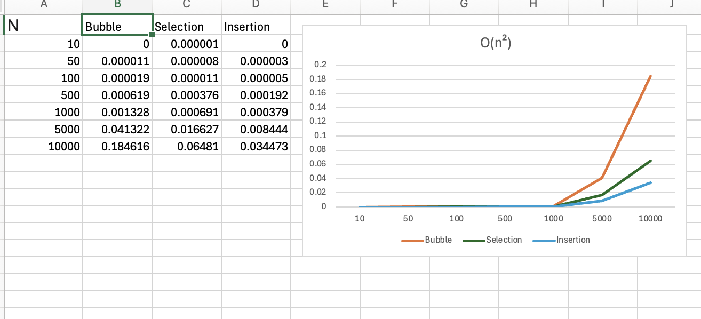

# Sort Analysis Data

## Results Table
Make sure to go out to at least 100,000 (more are welcome), and you have 10 different values (more welcome). You are welcome to go farther, but given 100,000 can take about 20 seconds using a selection sort on a fast desktop computer, and 200,000 took 77 seconds, you start having to wait much longer the more 0s you add. However, to build a clearer line, you will want more data points, and you will find merge and quick are able to handle higher numbers easier (but at a cost you will explore below). 

You are free to write a script to run the program and build your table (then copy that table built into the markdown). If you do that, please include the script into the repo.  Note: merge and quick sorts are going to be explored in the team activity for Module 06. You can start on it now, but welcome to wait.

 

### Table [^note]
| N | Bubble | Selection | Insertion | Merge | Quick |
| :-- | :--: | :--: | :--: | :--: | :--: |
| 10 | 0.000000 | 0.000001 | 0.000000 | 0.000001 | 0.000001 |
| 50 | 0.000011 | 0.000008 | 0.000003 | 0.000008 | 0.000005 |
| 100 | 0.000019 | 0.000011 | 0.000005 | 0.000007 | 0.000004 |
| 500 | 0.000619 | 0.000376 | 0.000192 | 0.000093 | 0.000049 |
| 1000 | 0.001328 | 0.000691 | 0.000379 | 0.000100 | 0.000061 |
| 5000 | 0.041322 | 0.016627 | 0.008444 | 0.000479 | 0.000312 |
| 10000 | 0.184616 | 0.064810 | 0.034473 | 0.001007 | 0.000674 |
| 50000 | - | - | - | 0.005599 | 0.003905 |
| 100000 | - | - | - | 0.012048 | 0.008330 |
| 500000 | - | - | - | 0.068683 | 0.047434 |


## BigO Analysis  / Questions

### 1. Build a line chart
Build a line chart using your favorite program. Your X axis will be N increasing, and your Y access will be the numbers for each type of sort. This will create something similar to the graph in the instructions, though it won't be as smooth. Due to speed differences, you may need to break up the $O(\log n)$ and $O(n^2)$ into different charts.

Include the image in your markdown. As a reminder, you save the image in your repo, and use [image markdown].





### 2. Analysis
Looking at the graph and the table, what can you say about the various sorts? Which are the fastest? Which are the slowest? Which are the most consistent? Which are the least consistent? Use this space to reflect in your own words your observations.


Looking at the table, quick sort is fastest, and the bubble sort is the slowest. In terms of consistency, selection sort is most stable one. So what I can observe here is that, for smaller arrays under 100 elements, everything runs fast. But once the array size gets bigger, the difference is massive. 


### 3. Big O
Build another table that presents the best, worst, and average case for Bubble, Selection, Insertion, Merge, and Quick. You are free to use resources for this, but please reference them if you do. 


| Algorithm | Best Case | Average Case | Worst Case |
|-----------|-----------|--------------|------------|
| Bubble | O(n) | O(n²) | O(n²) |
| Selection | O(n²) | O(n²) | O(n²) |
| Insertion | O(n) | O(n²) | O(n²) |
| Merge | O(n log n)| O(n log n) | O(n log n) |
| Quick | O(n log n)| O(n log n) | O(n²) |


#### 3.2 Worst Case
Provide example of arrays that generate _worst_ case for Bubble, Selection, Insertion, Merge Sorts


bubble sort: `[10, 9, 8, 7, 6, 5, 4, 3, 2, 1]` 


Selection sort: `[5, 2, 8, 1, 9, 3, 7, 4, 6]`


Insertion sort: `[10, 9, 8, 7, 6, 5, 4, 3, 2, 1]` 

Merge Sort:  `[5, 2, 8, 1, 9, 3, 7, 4, 6]` 

#### 3.3 Best Case
Provide example of arrays that generate _best_ case for Bubble, Selection, Insertion, Merge Sorts 


bubble sort: `[1, 2, 3, 4, 5, 6, 7, 8, 9, 10]`

selection: `[5, 2, 8, 1, 9, 3, 7, 4, 6]`

insertion: `[1, 2, 3, 4, 5, 6, 7, 8, 9, 10]`

merge: `[5, 2, 8, 1, 9, 3, 7, 4, 6]`


#### 3.4 Memory Considerations
Order the various sorts based on which take up the most memory when sorting to the least memory. You may have to research this, and include the mathematical notation. 

1. merge
2. quick
3. bubble
4. selection
5. insertion

### 4. Growth of Functions
Give the following values, place them correctly into *six* categories. Use the bullets, and feel free to cut and paste the full LatexMath we used to generate them.  

$n^2$  
$n!$  
$n\log_2n$  
$5n^2+5n$  
$10000$  
$3n$    
$100$  
$2^n$  
$100n$  
$2^{(n-1)}$
#### Categories
* Constant: $100$, $10000$
* Linear: $3n$, $100n$
* Linearithmic: $n\log_2n$
* Quadratic: $n^2$, $5n^2+5n$
* Exponential: $2^n$, $2^{(n-1)}$
* Factorial: $n!$


### 5. Growth of Function Language

Pair the following terms with the correct function in the table. 
* Constant, Logarithmic, Linear, Quadratic, Cubic, Exponential, Factorial

| Big $O$     |  Name  |
| ------      | ------ |
| $O(n^3)$    |  Cubic |
| $O(1)$      | Constant  |
| $O(n)$      | Linear  |
| $O(\log_2n)$ | Logarithmic  |
| $O(n^2)$    | Quadratic  |
| $O(n!)$     | Factorial  |
| $O(2^n)$    | Exponential  |


### 6. Stable vs Unstable
Look up stability as it refers to sorting. In your own words, describe one sort that is stable and one sort that isn't stable  


A stable sort is insertion sort. If there are two 5 in the list, the one that comes first in the original list will still come first after sorting.

An unstable sort is selection sort. It can change the order of numbers that are the same because it moves numbers around when it finds the smallest one.


### 6.2 When stability is needed?
Explain in your own words a case in which you will want a stable algorithm over an unstable. Include an example.


Stability is needed when the order of same items matters. For example, I have students with names and grades like
* Alex - B
* Bob - A
* Zoe - B

If I sort by grade using a stable sort, students with the same grade stay in the same order. The list becomes:
* Bob - A
* Alex - B
* Zoe - B

Alex is still before Zoe because they both have B.

If I use an unstable sort, Alex and Zoe might change order. I want a stable sort when the original order of equal items is important.

### 7. Gold Thief

You are planning a heist to steal a rare coin that weighs 1.0001 ounces. The problem is that the rare coin was mixed with a bunch of counter fit coins. You know the counter fit coins only weight 1.0000 ounce each. There are in total 250 coins.  You have a simple balance scale where the coins can be weighed against each other. Hint: don't think about all the coins at once, but how you can break it up into even(ish) piles. 

#### 7.1 Algorithm
Describe an algorithm that will help you find the coin. We encourage you to use pseudo-code, but not required.


To find the one heavier coin among 250 coins, the key is to divide the coins into smaller groups and weigh them instead of comparing every coin one by one.

Algorithm idea:

Divide the 250 coins into 3 roughly equal piles.

Weigh two piles against each other.

If they balance, the heavier coin is in the pile you didn’t weigh.

If they don’t balance, the heavier coin is in the heavier pile.

Take the pile with the heavier coin and divide it into 3 smaller piles.

Repeat steps 2–3 until only one coin is left.


My pseudo-code:
```
function find_haviest_coin(coins):
    while coins > 1:
        divide coins into 3 piles:
            compare pile 1 and pile 2:
                if pile 1 = pile 2:
                    coins = pile 3
                elif pile 1 > pile 2:
                        coins = pile 1
                else:
                    coin = pile 2
        return coins[0]
```


#### 7.2 Time Complexity
What is the average time complexity of your algorithm? 

My algorithm reduces the number of coins to check by 2/3 each time instead of checking one by one. So the number of weighings needed is about log base 3 of n, where n is the number of coins. For 250 coins, it will take roughly log₃(250). So the average time complexity is O(log n).

## Technical Interview Practice Questions

For both these questions, are you are free to use what you did as the last section on the team activities/answered as a group, or you can use a different question.

1. Select one technical interview question (this module or previous) from the [technical interview list](https://github.com/CS5008-khoury/Resources/blob/main/TechInterviewQuestions.md) below and answer it in a few sentences. You can use any resource you like to answer the question.


**Analysis of Algorithms**
What is Big O? How does it help us analyze algorithms?

Big O notation is a way to measure how efficient an algorithm is. It tells us how the time it takes to run or the memory it uses grows as the size of the input increases. Essentially, it shows the maximum amount of time or space an algorithm might need, which helps us compare different algorithms and choose the best one for a problem.

When would we want an algorithm with a higher time complexity than another faster algorithm?

We want to an algorithm with a higher time complexity when it is simpler to write and understand, use less memory, or behave more predictably. Also, if the input size is small, the slower algorithm may still be fast enough, making the extra complexity of a faster algorithm unnecessary.

1. Select one coding question (this module or previous) from the [coding practice repository](https://github.com/CS5008-khoury/Resources/blob/main/LeetCodePractice.md) and include a c file with that code with your submission. Make sure to add comments on what you learned, and if you compared your solution with others. 
 

## Deeper Thinking
Sorting algorithms are still being studied today. They often include a statistical analysis of data before sorting. This next question will require some research, as it isn't included in class content. When you call `sort()` or `sorted()` in Python 3.6+, what sort is it using? 

#### Visualize
Find a graphic / visualization (can be a youtube video) that demonstrates the sort in action. 

#### Big O
Give the worst and best case time-complexity, and examples that would generate them. 

<hr>

## References
Add your references here. A good reference includes an inline citation, such as [1] , and then down in your references section, you include the full details of the reference. Use [ACM Reference format].

1. Reference info, date, etc.
2. ...


## Footnotes:
[^note]: You will want at least 10 different N values, probably more to see the curve for Merge and Quick. If bubble, selection, and insertion start to take more than a  minute, you can say $> 60s$ or - . For example 
    | N | Bubble | Selection | Insertion | Merge | Quick |
    | :-- | :--: | :--: | :--: | :--: | :--: |
    | 10,000|0.197758|0.070548|0.000070|0.000513|0.000230|
    |100,000|-|-|-|0.131061|0.018602|

<!-- links moved to bottom for easier reading in plain text (btw, this a comment that doesn't show in the webpage generated-->
[image markdown]: https://docs.github.com/en/get-started/writing-on-github/getting-started-with-writing-and-formatting-on-github/basic-writing-and-formatting-syntax#images

[ACM Reference Format]: https://www.acm.org/publications/authors/reference-formatting
[IEEE]: https://www.ieee.org/content/dam/ieee-org/ieee/web/org/conferences/style_references_manual.pdf


https://www.geeksforgeeks.org/dsa/comparison-among-bubble-sort-selection-sort-and-insertion-sort/

https://workat.tech/problem-solving/tutorial/sorting-algorithms-bubble-insertion-selection-sort-veubp86w3e1r

https://www.geeksforgeeks.org/dsa/analysis-algorithms-big-o-analysis/


